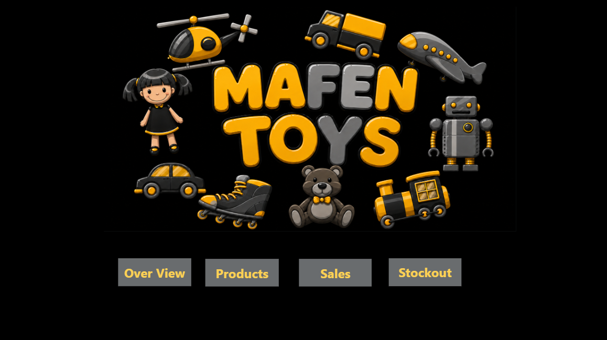
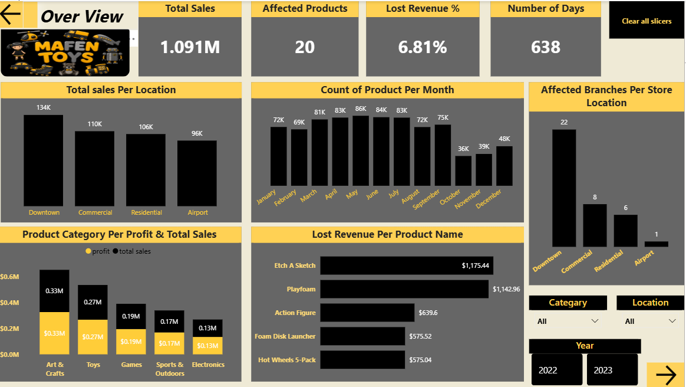
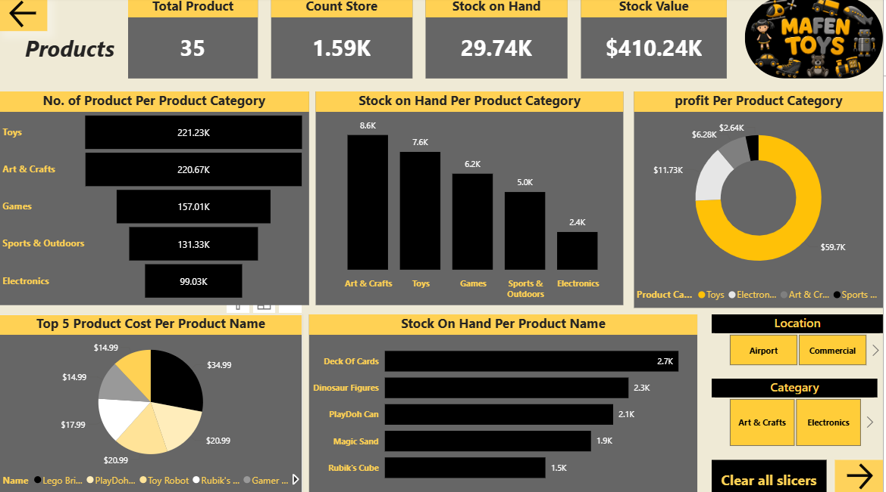
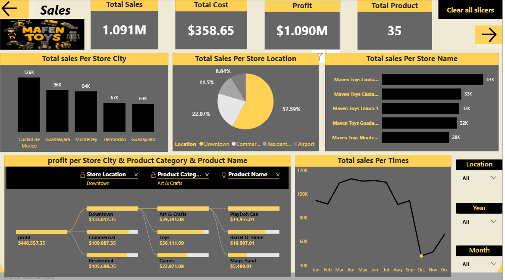
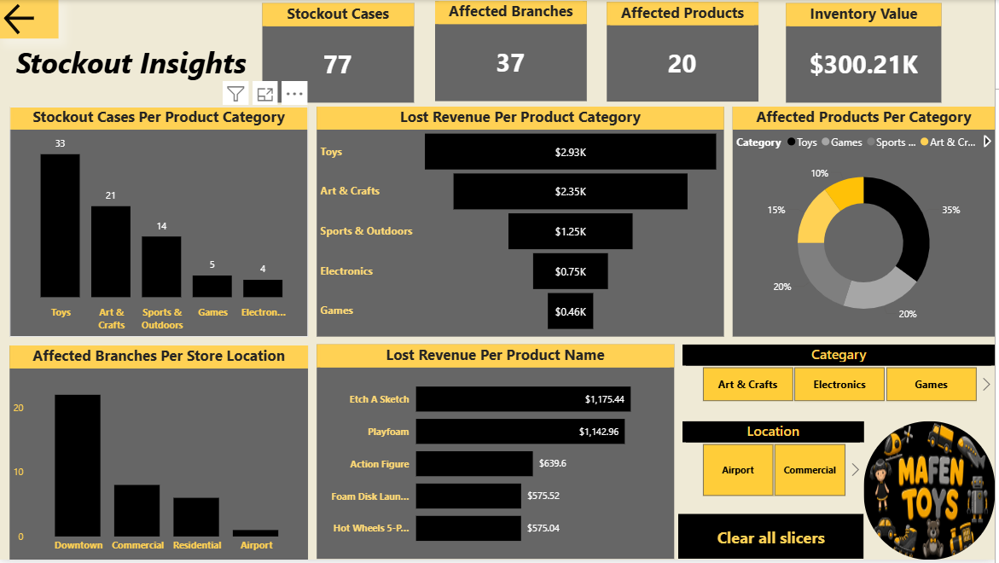

# 🧸 Mafen Toys Stockout Analysis Dashboard

##  Project Overview
This Power BI dashboard analyzes stockout cases across different product categories and store locations to identify:

- Lost revenue caused by stock shortages
- Most affected branches and products
- Inventory value insights
- Product performance trends
- Sales distribution across locations

---

# 📊 Dashboard Screenshots
## Home

## Overview 

## Product 

## Sales

## Stockout Insights 

---

# 🎯 Key Insights

- Toys category recorded the highest stockout cases
- Downtown branch had the highest affected cases
- Lost revenue percentage reached 6.81%
- Several products showed repeated stock shortages

---

# 🛠 Tools & Technologies

- Power BI
- Power Query
- DAX
- Data Modeling
- Excel

---

# 📂 Files Included

- Power BI Dashboard (.pbix)
- Dashboard Screenshots
- Project Documentation

---

# 🎥 Dashboard Demo Video

[Watch Dashboard Demo](PUT_VIDEO_LINK_HERE)

---

# 📥 Download PBIX File

[Download PBIX File](PUT_PBIX_LINK_HERE)
